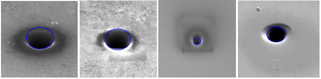
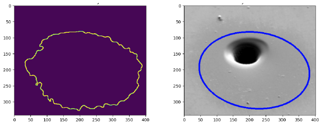
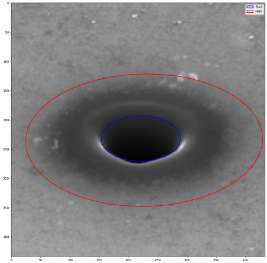

# Focused Ion Beam Hole Size Measurement
Computer vision project using OpenCV: Analyzes electron microscope images to measure hole size drilled by FIB technology. Developed in cooperation with Tescan a.s.





## Environment:
In order to run the script, you need python3.9 or greater and have installed dependencies.

## Dependencies:
Listed in `requirements.txt`. Install with\
``pip install -r requirements.txt``

## Usage:
```
usage: analyze_spot.py [-h] image

positional arguments:
  image       Path to the image

options:
  -h, --help  show this help message and exit
```

Example:\
``python analyze_spot.py example_data/0.png``
